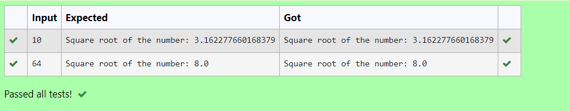

# Find the square root of a number

## AIM:
To write a program to find the square root of a number.

## Equipments Required:
1. Hardware – PCs
2. Anaconda – Python 3.7 Installation / Moodle-Code Runner

## Algorithm

## Step 1:
Define a function.
## Step 2:
Use for loop and set the iterating value as 10.
## Step 3:
Calculate  number = 0.5 * (x + b / x) for 10  iterations.
## Step 4:
Give the input.
## Step 5:
Call the function.

## Program:
```
#Program to to find the square root for the given number(newton's method) using function.
#Developed by: Rithiga Sri.B
#RegisterNumber: 21500732

def sqrt(x):
    
    for i in range(10):
        x=0.5*(x+b/x)

    print("Square root of the number:",x)
x=int(input()) 
b=x
sqrt(x)
```

## Output:



## Result:
Thus the program to find the square root for the given number(newton's method) using function is written and verified using python programming.
